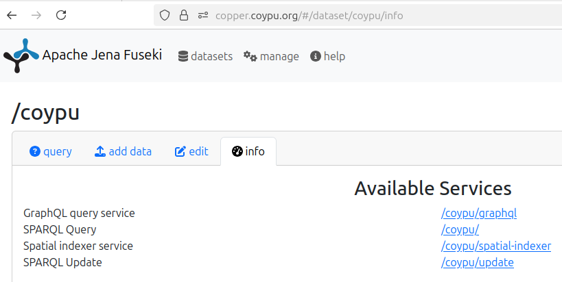

# graphql-over-sparql
Landing page for the GraphQL over SPARQL project.

The screenshot below shows our GraphQL integration in [Apache Jena's Fueski server](https://jena.apache.org/documentation/fuseki2/).


## Source Code

The source code is currently part of our [JenaX](https://github.com/Scaseco/jenax) project, a project that bundles several (unofficial) extensions for Apache Jena.

The GraphQL module comprises the engine, a simple user interface and a plugin for the Jena Fuseki server.

Link: https://github.com/Scaseco/jenax/tree/develop/jenax-graphql-parent/jenax-graphql-v2-parent

## Demos

* GraphQL-over-SPARQL demo: https://smartdataanalytics.github.io/RdfProcessingToolkit/graphql/
* Coypu endpoint (the one from the Screenshot): https://copper.coypu.org/#/dataset/coypu/info
* [Open Data Portal Leipzig](/odp-leipzig)

## Fuseki Plugin

From the release section of this page, download the approprite GraphQL plugin JAR for Fuseki and place the JAR
into Fuseki's extension directory. This should enable configuration of the GraphQL Fuseki Mod (fmod) `norse:graphql.fmod.op`.

The relevant Apache Jena Fuseki config is as follows.
```turtle
PREFIX ja:        <http://jena.hpl.hp.com/2005/11/Assembler#>
PREFIX norse:     <https://w3id.org/aksw/norse#>

<#service> rdf:type fuseki:Service ;
  fuseki:name "coypu" ;
  fuseki:endpoint [ fuseki:operation fuseki:query ] ;
  fuseki:endpoint [
    fuseki:operation norse:graphql.fmod.op ;
    ja:context [ ja:cxtName "https://w3id.org/aksw/norse#graphql.schemaFile"          ; ja:cxtValue "/run/configuration/coypu.graphql" ] ;
    ja:context [ ja:cxtName "https://w3id.org/aksw/norse#graphql.sparqlQueryEndpoint" ; ja:cxtValue "/coypu" ] ;

    # Use this config to use YasGUI as the SPARQL viewer
    ja:context [ ja:cxtName "https://w3id.org/aksw/norse#graphql.sparqlQueryViewer"   ; ja:cxtValue "https://yasgui.triply.cc/#?query={ENCODED_SPARQL_QUERY}&endpoint={ENCODED_SPARQL_QUERY_ENDPOINT}" ] ;

    # Use this config to use Jena's native query editor
    # ja:context [ ja:cxtName "https://w3id.org/aksw/norse#graphql.sparqlQueryViewer"   ; ja:cxtValue "/#/dataset/coypu/query?query={ENCODED_SPARQL_QUERY}" ] ;
  ] ;
  fuseki:dataset <#yourDS> .
```

## Using GraphQL with the RDF Processing Toolkit
The examples below use `YOUR_DATA.nt`, but any RDF format supported by Apache Jena can be used (e.g. turtle).

* The schema generator is part of rpt:

```bash
rpt graphqltk schemagen catalog.ttl > catalog.graphql
```

* Start a server over a file with your own RDF data

```bash
rpt integrate --server catalog.ttl --graphql-schema schema.graphql
```

* Start a server with SPARQL polyfill for LATERAL (will make many requests!)

```bash
rpt integrate -e remote --loc http://your.sparql/endpoint --graphql-schema schema.graphql --polyfill-lateral
```


